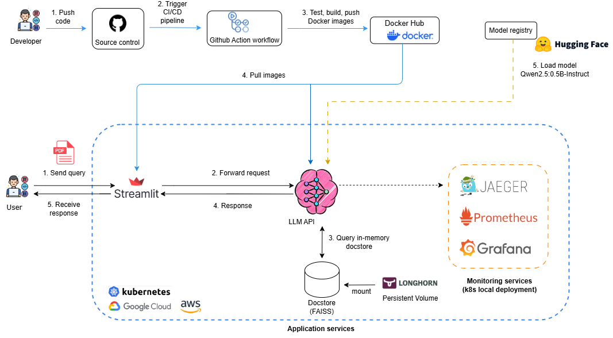

# 🚀 Tiny LLM Chat Agent


A **FastAPI + Streamlit** based **Retrieval-Augmented Generation (RAG) chatbot**, designed to chat with users using local **large language models (LLMs)** while allowing **PDF uploads** for context-aware conversations. The system leverages the **Qwen-2.5:0.5B-Instruct** model, a lightweight LLM optimized for **efficient on-device processing**. This minimum setup ensures **fast response times** while enabling **customized knowledge retrieval** from uploaded documents, making it ideal for research, study, and technical applications.

**Disclaimer**: The `tiny-llm-agent` is provided for the demonstration purpose. It is implemented to run on CPU to ensure compatibility with most hardware devices. Additionally, the response length is limited to a fixed number of tokens because the small LLM cannot efficiently handle very long contexts. Expanding beyond these limitations can be achieved by using a larger model (e.g., Qwen2.5-7B) and enabling GPU processing for faster responses. See [rag-pipeline/notebooks/poc-rag-code.ipynb](rag-pipeline/notebooks/poc-rag-code.ipynb), [rag-pipeline/src/main.py](rag-pipeline/src/main.py), and [rag-pipeline/Dockerfile](rag-pipeline/Dockerfile) for detailed implementation and configuration.

**Architecture** of the platform is as follows:   
  

The MLOps system illustrated in the image operates through two distinct pipelines:  
- **For developers**, the workflow begins with pushing code to a source control system (step 1), triggering a CI/CD pipeline (steps 2). The CI/CD pipeline tests code, build Docker images, and update Docker images tag values to Kubenetes helm-chart for Continuous Deployment. After that, it pushes Docker images to Docker Hub registry (step 3). These images are then pulled in a Kubernetes cluster (step 4). Once the services start, Gwen LLM model will be downloaded from HuggingFace model registry and stored in the Kubernetes cluster (step 5).  
- **For users**, interactions start with a query from user on Streamlit frontend (step 1), which routes requests to RAG Pipeline (backend) for Gwen model handles (steps 2), retrieves relevant vectors from the FAISS database (step 3), and returns a response (step 4) to Streamlit UI. 

**Mornitoring services** are managed by developers using `Jaeger`, `Prometheus`, and `Grafana`, ensuring observability for admin.


  
## 📌 Features
✅ **FastAPI backend** to handle local LLM inference and document retrieval.  
✅ **Streamlit frontend** for lightweight and interactive chat experience.  
✅ **RAG support** to enrich personalized chat experience.  
✅ **Automatic deployment** with Docker and Kubernetes.  
✅ **LLM runs locally**, no external APIs required.  
✅ **Monitoring services** provide dashboards that measure system performance (e.g., chat response time, CPU usage) using Prometheus, Grafana, and Jaeger tracing.  
✅ **CI/CD** for automatic testing and building containers with Github Action.  
✅ **Cloud support** for hosting LLM on GCP (Google Kubernetes Engine), AWS (Elastic Kubernetes Service) and Azure(Azure Kubenetes Service).

---

## 📂 Project Structure
```
llm-agent/    
│── .github/workflows         # Github Action workflows for CI/CD pipeline
│
├─ rag-pipeline/              # Backend (FastAPI)  
│ ├─── vector_store/          # Vector database (FAISS)  
│ ├─── examples/              # Example PDF files  
│ ├─── models/                # Local model storage  
│ ├─── notebooks/             # Notebooks for PoCs  
│ ├─── src/                   # Source code  
│ ├─── test/                  # Pytest code 
│ ├─── uploaded_pdfs/         # Uploaded user PDFs  
│ ├─── vector_store/          # FAISS vector database  
│ ├─── Dockerfile             # Backend Docker configuration  
│ ├─── requirements.txt       # Backend dependencies  
│
├─ streamlit/                 # Frontend (Streamlit)  
│ ├─── main.py                # Streamlit UI logic  
│ ├─── requirements.txt       # Frontend dependencies  
│ ├─── Dockerfile             # Frontend Docker configuration  
│
├─ kubernetes/                # Local deployment & cloud deployment
│  
└── README.md                 # Project Documentation  

```

## 📦 Project Dependencies
- Docker desktop version 27.3.1    
- Kubectl version v1.32.2
- Helm version v3.17.1  
